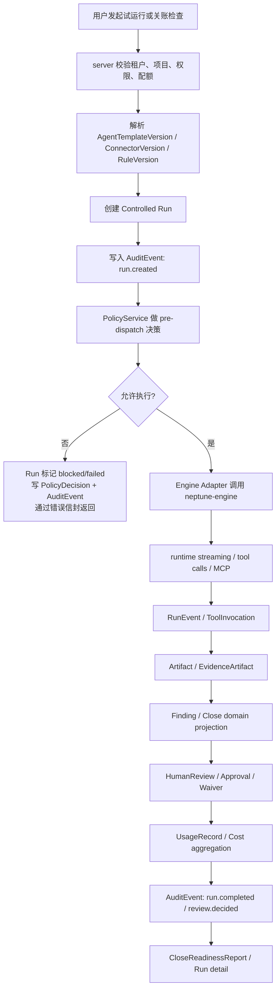

# Neptune AgentOps 技术架构设计

日期：2026-05-22

参考文档：

- `docs/strategy/neptune-agentops-platform-strategy.md`
- `docs/superpowers/specs/2026-05-22-neptune-agentops-product-architecture-design.md`

## 0. 结论

Neptune 当前阶段的技术架构中心不是 `Conversation`，而是 `Controlled Run`。聊天、SSE、工具输出、模型推理都只是运行过程的交互形态；企业真正需要长期保存、审计、复核和升级解释的是受控执行事实链。

本设计的核心结论：

1. `neptune-ai/web` 承载产品体验：交付台、治理台、关账工作台，不直接暴露 runtime 内部细节。
2. `neptune-ai/server` 承载 AgentOps 平台内核：项目、智能体版本、Run、Artifact、Evidence、Policy、Review、Audit、Cost、Solution Pack 编排。
3. `shared` 承载跨层 DTO、REST/SSE contract、错误信封和观测上下文字段，避免 web/server/engine 各自发明协议。
4. `neptune-engine` 保持 Runtime Kernel：LLM、工具执行、MCP、streaming、trace、artifact hook。当前任务不修改 `neptune-engine`，也不把财务、ERP、关账、审批、审计责任下沉到 engine。
5. 架构必须同时分清数据平面、控制平面、事实平面、治理平面。否则系统会退化成“能跑 demo 的聊天应用”，而不是能进入企业生产责任链的 AgentOps 平台。

最小主链：

```text
CustomerProject
  -> AgentTemplateVersion
  -> Controlled Run
  -> RunEvent / ToolInvocation
  -> Artifact / EvidenceArtifact
  -> Finding
  -> HumanReview / Approval / Waiver
  -> AuditEvent
  -> UsageRecord / Cost
  -> CloseReadinessReport
```

## 1. 架构原则

### 1.1 受控委托优先

企业不会把最终业务责任交给模型。Neptune 的职责是把不确定的智能体行为包进可治理、可交付、可审计、可升级的执行协议里，并证明：

- 谁发起了运行；
- 使用了哪个客户项目、智能体版本、规则版本、连接器版本和模型配置；
- 在什么权限和策略结果下执行；
- 读取了哪些证据；
- 调用了哪些工具；
- 产出了哪些 artifact、finding 和报告；
- 谁复核、批准、退回或豁免；
- 成本、错误、审计事件如何关联；
- 历史结果在升级后仍可解释。

### 1.2 业务语义留在产品层

中国 ERP 财务月结关账是第一 Solution Pack，用来逼出平台内核，不是把 Neptune 改造成财务 SaaS。`CloseWorkspace`、`AccountingPeriod`、`ControlRule`、`Finding`、`CloseReadinessReport` 等对象属于 `neptune-ai/server` 的业务层或 solution pack 层；它们通过平台对象落地为 `Run`、`EvidenceArtifact`、`HumanReview`、`AuditEvent`。

### 1.3 Runtime Kernel 不承担产品责任

`neptune-engine` 应该提供通用执行能力，而不是理解客户项目、财务规则、审批责任、审计保留、成本归因或中文产品页面。产品责任在 `neptune-ai/server`，协议责任在 `shared`，执行责任在 `neptune-engine`。

## 2. 总体架构图

```text
┌─────────────────────────────────────────────────────────────────────────────┐
│                              neptune-ai/web                                │
│                                                                             │
│  交付台                         治理台                         关账工作台     │
│  客户项目 / 智能体模板 / 试运行   运行记录 / 审计 / 成本 / 策略   期间 / 证据 / 复核 │
└───────────────────────────────────┬─────────────────────────────────────────┘
                                    │ REST / SSE / shared DTO
┌───────────────────────────────────▼─────────────────────────────────────────┐
│                            neptune-ai/server                               │
│                                                                             │
│  业务应用服务                                                                 │
│    CloseWorkspace / AccountingPeriod / Checklist / Finding / Report          │
│                                                                             │
│  AgentOps Platform Services                                                  │
│    Project / AgentRegistry / RunControl / ArtifactEvidence / Review          │
│    Policy / ConnectorRegistry / AuditTrail / CostQuota / Observability       │
│                                                                             │
│  Engine Adapter / Runtime Boundary                                           │
│    只传通用执行上下文、工具、MCP、policy/artifact hook，不传财务专属概念          │
└───────────────────────────────────┬─────────────────────────────────────────┘
                                    │ stable contracts
┌───────────────────────────────────▼─────────────────────────────────────────┐
│                                  shared                                     │
│                                                                             │
│  DTO / REST error envelope / SSE event / request context / domain contracts  │
└───────────────────────────────────┬─────────────────────────────────────────┘
                                    │ runtime API / events
┌───────────────────────────────────▼─────────────────────────────────────────┐
│                              neptune-engine                                 │
│                                                                             │
│  LLM / tools / MCP / streaming / trace / runtime lifecycle / artifact hooks  │
│  不包含财务、ERP、关账、审计责任、产品治理对象                                  │
└─────────────────────────────────────────────────────────────────────────────┘
```

## 3. 源码边界

| 源码区域 | 核心职责 | 可以包含 | 不应包含 |
| --- | --- | --- | --- |
| `neptune-ai/web` | 产品入口和工作流呈现 | 交付台、治理台、关账工作台、运行详情、证据、复核、报告、中文状态与错误恢复路径 | engine 内部状态机、直接工具执行、绕过 server 的审计/策略调用、把 Chat 作为主产品架构 |
| `neptune-ai/server` | 产品编排层与平台服务层 | 租户、客户项目、智能体 registry、版本快照、Run lifecycle、artifact/evidence、policy decision、review、audit、cost、Solution Pack 业务对象 | runtime 内部实现、模型 provider 细节泄漏到业务服务、把财务语义写进 engine adapter |
| `shared` | 跨层协议和稳定 contract | REST DTO、SSE event、错误信封、观测上下文、Run/Artifact/Review/Audit 等共享类型 | 业务流程实现、数据库访问、React 组件、engine 执行逻辑 |
| `neptune-engine` | 通用智能体 Runtime Kernel | LLM 调用、工具执行、MCP client、streaming、trace、runtime artifact hook、policy hook 接入点 | 财务关账规则、ERP 对象、客户项目、审批工作流、审计责任、成本归因、中文产品语义 |

边界判断标准：

- 如果对象回答“业务上这是什么”，放在 `neptune-ai/server` 的业务层或 solution pack 层。
- 如果对象回答“企业如何治理一次智能体执行”，放在 `neptune-ai/server` 的 AgentOps 平台内核。
- 如果对象回答“前后端如何稳定通信”，放在 `shared`。
- 如果对象回答“智能体如何调用模型和工具”，才进入 `neptune-engine`。

## 4. 运行时边界

运行时边界不是源码目录边界的重复，而是责任和数据移动边界。

```text
用户 / 交付人员 / 治理人员 / 财务人员
  │
  ▼
neptune-ai/web
  │  REST command / query
  │  SSE subscribe
  ▼
neptune-ai/server
  │  authn/authz
  │  project + version resolution
  │  policy pre-check
  │  run creation
  │  audit append
  │
  ├──► Customer DB：Run、Artifact、Review、Audit、Cost、Solution Pack 状态
  │
  └──► Engine Adapter
          │ generic runtime context
          ▼
      neptune-engine
          │ LLM / tools / MCP / streaming / trace
          ▼
      RunEvent / ToolInvocation / Artifact hooks
          │
          ▼
      neptune-ai/server 持久化事实、推送 SSE、生成审计和成本记录
```

运行时硬边界：

| 边界 | 允许穿越的内容 | 不允许穿越的内容 |
| --- | --- | --- |
| web -> server | REST command/query、SSE 订阅参数、shared DTO | 直接 runtime 指令、未经 server 授权的工具参数、直接数据库访问 |
| server -> engine | 通用执行上下文、模型/工具/MCP 配置、policy/artifact hook、stream 回调 | 财务专属对象、审批责任、审计保留策略、成本计费规则 |
| engine -> server | runtime event、tool invocation result、artifact metadata、trace id、error | 直接写产品数据库、直接生成业务审计结论、直接改变业务状态 |
| server -> storage | 平台事实、证据元数据、审计事件、成本记录、业务状态 | 未分类的 prompt dump、不可追溯的临时结果 |

## 5. 四个平面

### 5.1 数据平面

数据平面处理客户侧真实数据和执行产物，目标是把敏感数据留在客户环境或项目环境中。

包含：

- ERP / CSV / Excel / 文件 / API 证据源；
- connector runtime；
- artifact store；
- customer DB；
- runtime 输入输出；
- EvidenceArtifact 的 `source`、`hash`、`storageUri`、`runId`、`versionRef`。

设计要求：

- 证据内容和敏感财务数据不进入未来 cloud control plane；
- artifact 必须有来源、hash 和 run 绑定；
- Run 不保存无法归因的裸输出；
- Evidence 与 Finding 必须可互相追溯。

### 5.2 控制平面

控制平面决定什么可以被配置、发布、执行和升级。

当前阶段控制平面主要在 `neptune-ai/server` 本地实现，未来可演进为 Neptune Cloud Control Plane + 客户侧 Data Plane。

包含：

- tenant / project / member；
- AgentTemplate / AgentTemplateVersion；
- Connector / ConnectorVersion；
- Policy template / PolicyDecision；
- ReleaseVersion；
- Solution Pack version；
- quota / concurrency gate；
- pre-dispatch validation。

设计要求：

- 当前不提前建设重型云控制面；
- 但所有重要对象必须保留版本语义；
- 每次 Run 必须绑定具体版本；
- 升级不能改变历史 Run 的解释。

### 5.3 事实平面

事实平面是 AgentOps 的生产账本。它回答“发生了什么”，不回答“界面怎么展示”。

包含：

- Run；
- RunEvent；
- ToolInvocation；
- Artifact；
- EvidenceArtifact；
- Finding；
- HumanReview / Approval / Waiver；
- UsageRecord；
- CloseReadinessReport snapshot。

设计要求：

- `Run` 是事实平面的主键，不是 chat thread 的附属物；
- `Finding` 必须引用 rule、run、evidence、severity；
- `HumanReview` 必须记录 reviewer、decision、reason、timestamp；
- `UsageRecord` 必须能按 tenant/project/agent/run/model 聚合。

### 5.4 治理平面

治理平面回答“是否可解释、可追责、可审计、可控成本”。

包含：

- AuditEvent；
- PolicyDecision；
- Observability trace；
- requestId / runId / tenantId / actorId；
- error envelope；
- audit export；
- retention policy；
- eval / acceptance gate。

设计要求：

- 审计事件是责任事实，必须 append-only；
- observability 是工程排障事实，可采样、可聚合、可对接 Langfuse/metrics；
- 两者可以共享 correlation id，但不能混为一个表或一个语义模型。

## 6. Controlled Run 主链



主链约束：

1. 先创建 `Run`，再调用 runtime。不能 runtime 跑完后补造运行记录。
2. 先做权限、配额、策略预检查，再 dispatch。不能用运行失败替代治理拒绝。
3. 每个 runtime event 必须可关联 `runId` 和 `requestId`。
4. 每个 artifact/evidence 必须关联 `runId`、来源、hash 和生成方式。
5. 每个人工决策必须进入 `HumanReview` 和 `AuditEvent`。
6. Run 结束不是事实链结束；复核、豁免、报告导出仍要继续进入审计链。

## 7. REST / SSE / shared DTO

### 7.1 REST 分层

REST API 应按产品语义和治理语义分组，而不是按聊天实现分组。

| API 组 | 典型资源 | 用途 |
| --- | --- | --- |
| `/api/projects` | `CustomerProjectDto` | 客户项目、成员、环境、Solution Pack 归属 |
| `/api/agents` | `AgentTemplateDto`、`AgentTemplateVersionDto` | 智能体模板、版本快照、绑定项目 |
| `/api/runs` | `RunDto`、`RunEventDto`、`ToolInvocationDto` | Controlled Run 创建、查询、取消、详情 |
| `/api/artifacts` | `ArtifactDto`、`EvidenceArtifactDto` | 成果文件、证据索引、hash、来源 |
| `/api/reviews` | `HumanReviewDto` | 待复核、批准、退回、豁免 |
| `/api/audit-events` | `AuditEventDto` | 审计事件查询与导出 |
| `/api/policy-decisions` | `PolicyDecisionDto` | 策略决策查询 |
| `/api/usage-records` | `UsageRecordDto` | 成本和用量聚合 |
| `/api/close-workspaces` | `CloseWorkspaceDto`、`FindingDto`、`CloseReadinessReportDto` | 财务关账 Solution Pack |

### 7.2 SSE 事件

SSE 是运行过程观察通道，不是事实来源本身。事实来源必须由 server 持久化。

推荐事件族：

| SSE event | 含义 | 必要字段 |
| --- | --- | --- |
| `run.started` | Run 已进入执行 | `requestId`、`runId`、`tenantId`、`agentVersionId`、`startedAt` |
| `run.event` | 通用运行事件 | `requestId`、`runId`、`sequence`、`eventType`、`message` |
| `tool.started` | 工具调用开始 | `runId`、`toolInvocationId`、`toolName`、`policyDecisionId` |
| `tool.completed` | 工具调用完成 | `runId`、`toolInvocationId`、`status`、`durationMs` |
| `artifact.created` | artifact/evidence 已登记 | `runId`、`artifactId`、`artifactType`、`hash` |
| `review.requested` | 需要人工复核 | `runId`、`reviewId`、`reviewType`、`reason` |
| `run.completed` | Run 完成 | `runId`、`status`、`usageRecordId`、`completedAt` |
| `run.failed` | Run 失败 | `runId`、`error`、`auditEventId` |

### 7.3 shared DTO 原则

`shared` 中的 DTO 应该稳定表达跨层 contract：

- 字段使用协议语义，不使用 UI 文案；
- 枚举可以保留英文，web 负责中文展示；
- DTO 不包含数据库 ORM 细节；
- DTO 不泄漏 engine 内部对象；
- 业务 DTO 可以引用平台对象 id，但不能复制平台对象全部字段；
- 所有 command response 都必须能返回 `requestId`，便于排障和审计关联。

## 8. 错误信封

错误信封是产品体验、排障和审计之间的共同协议。它不能只是 `message` 字符串，也不能把内部异常直接透给用户。

推荐结构：

```ts
type ApiErrorEnvelope = {
  error: {
    code: string;
    message: string;
    userMessage: string;
    requestId: string;
    runId?: string;
    auditEventId?: string;
    policyDecisionId?: string;
    retryable: boolean;
    details?: Record<string, unknown>;
  };
};
```

错误分类：

| 类别 | 示例 code | HTTP / SSE 处理 | 审计要求 |
| --- | --- | --- | --- |
| 输入错误 | `VALIDATION_FAILED` | REST 400，展示中文恢复动作 | 通常不需要审计，关键业务 command 需要 |
| 认证授权 | `UNAUTHORIZED`、`FORBIDDEN` | REST 401/403 | 访问受保护资源失败需要审计 |
| 配额/成本 | `QUOTA_EXCEEDED` | REST 429 或 Run blocked | 写 `PolicyDecision` 和 `AuditEvent` |
| 策略拒绝 | `POLICY_DENIED` | Run blocked，SSE `run.failed` | 必须写 `PolicyDecision` 和 `AuditEvent` |
| runtime 失败 | `RUNTIME_FAILED` | Run failed，保留 trace id | 写 RunEvent、AuditEvent、Observability |
| 工具失败 | `TOOL_FAILED` | ToolInvocation failed，可继续或终止 | 写 ToolInvocation 和 RunEvent |
| 外部连接失败 | `CONNECTOR_UNAVAILABLE` | 根据 retryable 指导重试 | 写 RunEvent，必要时写 AuditEvent |
| 系统错误 | `INTERNAL_ERROR` | REST 500，隐藏内部细节 | 写 observability，关键命令写 AuditEvent |

用户界面展示 `userMessage`，调试抽屉展示 `code/requestId/runId/auditEventId`。内部 `message/details` 只面向开发和治理排障，不应成为业务用户主路径文案。

## 9. 可观测性与审计分离

可观测性和审计都需要时间、上下文和 correlation id，但它们不是同一件事。

| 维度 | 可观测性 Observability | 审计 Audit |
| --- | --- | --- |
| 目的 | 工程排障、性能分析、稳定性、成本优化 | 责任追溯、合规证明、复核证据 |
| 典型对象 | trace、span、metric、log、model latency、token usage | AuditEvent、actor、resource、action、outcome、reason |
| 写入策略 | 可采样、可聚合、可降级 | append-only，关键事件不可丢 |
| 保留策略 | 按成本和排障周期设置 | 按客户、合规和合同要求设置 |
| 用户 | 工程、运维、平台治理 | 客户治理、审计、业务责任人 |
| 失败影响 | 观测系统失败不能阻断所有业务，但要告警 | 关键审计写入失败时应阻断关键业务命令 |

共享上下文字段：

```text
requestId
tenantId
projectId
runId
agentTemplateId
agentVersionId
actorId
model
connectorVersionId
policyDecisionId
auditEventId
traceId
```

分离原则：

1. `AuditEvent` 不等于日志。它是责任事实，不是排障文本。
2. trace 不等于审计。trace 可以帮助解释执行过程，但不能替代 actor/action/outcome/reason。
3. `UsageRecord` 同时服务成本治理和观测分析，但必须绑定 Run 事实链。
4. 关键业务事件如果审计写入失败，应该阻断或标记为未完成，不能静默成功。

## 10. 为什么当前不改 `neptune-engine`

当前任务不修改 `neptune-engine` 是架构选择，不是技术保守。

原因：

1. 现在缺的是产品治理事实链，不是 runtime 能力。`Run`、`Evidence`、`Review`、`Audit`、`Cost` 的产品语义应先在 `neptune-ai/server` 固化。
2. 财务 Solution Pack 是平台验证场景，不是 engine 的新领域。把关账规则放进 engine 会污染 Runtime Kernel，让通用 SDK 变成行业 SDK。
3. engine 应通过 adapter 接收通用执行上下文。只要 server 能把 AgentVersion、tools、MCP、policy hook、artifact hook 映射为 runtime contract，就不需要让 engine 理解财务对象。
4. 修改 engine 会扩大 blast radius：影响 SDK 导出、runtime 生命周期、工具执行、MCP 和现有消费者，和本阶段“只建立产品主链”的目标不匹配。
5. 边界先清楚，后续才知道是否真的需要 engine hook 扩展。如果未来发现缺少通用 hook，应以 runtime-neutral 的方式新增，而不是以 `CloseWorkspace`、`ERP`、`AccountingPeriod` 等业务概念驱动。

可接受的未来 engine 变更只有两类：

- 通用 runtime hook：例如更稳定的 artifact hook、policy hook、human review hook、trace event hook；
- 通用执行能力：例如 MCP streaming、tool cancellation、structured runtime event、provider abstraction。

不可接受的 engine 变更：

- 新增财务/ERP/关账类型；
- 在 engine 内写入审计责任；
- 在 engine 内决定审批、豁免、成本计费；
- 让 engine 直接依赖 `neptune-ai/server` 的业务服务。

## 11. 风险防线

| 风险 | 失控表现 | 防线 |
| --- | --- | --- |
| 退化成聊天产品 | UI 和 API 围绕 Conversation，Run 只是附属记录 | 产品入口改为交付台/治理台/关账工作台；Run 成为主事实对象 |
| 财务语义污染 runtime | `neptune-engine` 出现 ERP、AccountingPeriod、CloseReport | 财务对象只在 `neptune-ai/server` solution pack；engine adapter 只传通用上下文 |
| 审计与日志混用 | 关键责任事实只存在 log/trace，无法导出或证明 | `AuditEvent` append-only；关键 command 审计失败则阻断 |
| SSE 成为事实来源 | 刷新后运行过程丢失，历史不可解释 | server 先持久化 RunEvent/ToolInvocation/Artifact，再推送 SSE |
| DTO 分裂 | web/server/engine 字段名各自演进，错误不可追踪 | `shared` 固化 REST/SSE/error/request context contract |
| 历史结果被升级覆盖 | Agent、规则、连接器改版后旧 Run 无法解释 | 每次 Run 绑定 AgentTemplateVersion、ConnectorVersion、RuleVersion、ReportTemplateVersion |
| 策略后置 | 工具已执行才发现越权或超配额 | pre-dispatch quota/policy gate；拒绝也写 PolicyDecision/AuditEvent |
| 证据无来源 | Finding 无法证明依据，报告不可审计 | EvidenceArtifact 必须有 source/hash/storageUri/runId/versionRef |
| 成本不可归因 | 只能看到总 token，无法按项目/Agent/Run 分摊 | UsageRecord 绑定 tenant/project/agentVersion/run/model |
| 业务责任越界 | 智能体自动批准或替客户做最终关账判断 | HumanReview/Approval/Waiver 由人类 actor 决策并审计 |

## 12. 第一阶段落地顺序

1. 固化 `shared` contract：Run、RunEvent、ToolInvocation、Artifact、EvidenceArtifact、PolicyDecision、HumanReview、AuditEvent、UsageRecord、ApiErrorEnvelope、SSE event。
2. 在 `neptune-ai/server` 建立 RunControl 主链：pre-check、create Run、dispatch、persist event、finalize、audit、cost。
3. 将现有 chat/collaborate 能力降级为“运行调试”入口，避免产品架构继续围绕 chat 生长。
4. 建立治理台只读 API 和页面：运行记录、审计事件、智能体版本、成本、策略决策。
5. 建立关账工作台 MVP：期间、检查清单、证据、异常、复核、报告。
6. 只在出现 runtime-neutral hook 缺口时评估 `neptune-engine`，并通过 adapter 隔离变更。

## 13. 自检清单

- 是否所有用户可见业务责任都落到 `neptune-ai/server`，而不是 `neptune-engine`？
- 是否每个运行结果都能追溯版本、证据、策略、人和成本？
- 是否 REST/SSE/error/request context 都能通过 `shared` 统一？
- 是否审计事件和 observability trace 被明确分离？
- 是否 SSE 只是观察通道，而不是唯一事实来源？
- 是否所有财务对象都停留在 solution pack 层？
- 是否能解释“为什么当前不改 neptune-engine”？
