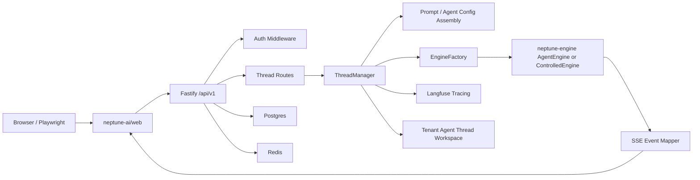

# Neptune Lab 项目架构文档

生成时间：2026-05-19 23:52 CST

## 一句话架构

Neptune Lab 是一个面向 AI Employee/Agent 协作的 monorepo：`neptune-ai` 承担产品编排、API、Web UI 和 SaaS 语义；`neptune-engine` 承担 Agent runtime、Claude Code 兼容执行、工具和 provider 抽象；`shared` 计划承载跨前后端契约，但当前仍基本为空。

## 模块边界

| 模块 | 当前职责 | 不应承担 |
|---|---|---|
| `neptune-ai/web` | 登录、Agent 管理、Skills、Collaborate、Chat SSE 消费、消息/工具/计划 UI | LLM provider 细节、工具执行策略 |
| `neptune-ai/server` | Auth、Tenant、Agent Template、Thread、Prompt 组装、EngineFactory、SSE、计费、Langfuse 可观测 | React/Ink UI、底层工具实现 |
| `neptune-engine` | AgentEngine、CCRuntime、QueryEngine bridge、provider registry、工具 runtime | 产品租户/用户/计费语义、Web UI |
| `shared` | 目标是共享 DTO/SSE/OpenAPI 类型 | 当前未落地，不能作为事实源 |

## 运行链路



## 核心数据模型

后端主实体：

- `tenants`：租户。
- `users`：用户，携带 `tenantId` 和 `role`。
- `agent_templates`：Agent 配置、系统提示词、模型配置、工具和 MCP 列表。
- `sessions`：当前实际承载 Thread，包含 `templateId/status/title/summary/workspace`。
- `skills` + `agent_skills`：技能及 Agent 关联。
- `documents`：Agent 知识库文档。
- `billing_records`：计费用量记录。

Thread workspace 当前格式：

```text
{DATA_ROOT}/tenants/{tenantId}/agents/{agentId}/threads/{threadId}/
```

该格式已经有 `thread-manager-workspace.test.ts` 覆盖，重点验证不再包含旧的 `users/{userId}` 层级。

## Chat/SSE 链路

1. Web `Collaborate` 使用 `useChatMessages.sendMessage()`。
2. Web API client `sendThreadMessage()` 用 `fetch POST /api/v1/agents/:agentId/threads/:threadId/chat` 读取 SSE stream。
3. Server `routes/threads.ts` 先写 `event: connected`，再迭代 `threadManager.dispatch()`。
4. `ThreadManager.dispatch()`：
   - 校验 Thread 状态；
   - 更新为 `running`；
   - 加载 Agent Template、skills、documents、agent.md；
   - 组装 instructions；
   - 通过 EngineFactory 创建 engine；
   - 迭代 `engine.query()`；
   - 处理 PlanManager 和 TracingEventProcessor；
   - 更新状态为 `idle` 或 `error`；
   - 销毁 engine。
5. `mapSSEEvent()` 将 SDK event 映射为前端 `text/thinking/tool_use/tool_result/tool_status/ask_user/plan/error/done`。
6. 路由把前端事件写入 `events.jsonl`，history API 再把 `events.jsonl` 转回 ChatMessage。

## Engine 接入模式

### 生产意图

`ClaudeCodeEngineFactory` 调用 `AgentEngine.create()`，注入：

- `identityOverride`
- `memoryRoot`
- `skills`
- `permissions`
- `tracingProvider`
- `metricsProvider`
- Anthropic-compatible provider config

### 当前测试模式

`ControlledEngineFactory` 在 `NEPTUNE_ENGINE_MODE=controlled` 或 `NEPTUNE_MOCK_LLM=1` 时启用。它产生 deterministic SDK event：

- `system`
- `thinking` stream
- `tool_use`
- `tool_result`
- `text_delta`
- `assistant`
- `result`

该模式用于验证产品编排、SSE、UI 和 history，不加载真实 engine/UI 链。

### 真实 engine 当前问题

真实路径仍穿透到 UI：

```text
ThreadManager -> ClaudeCodeEngineFactory -> AgentEngine
-> DefaultCCRuntime.getAllBaseTools()
-> neptune-engine/src/tools.ts
-> builtin-tools React/Ink UI modules
```

这与“engine 层应避免 UI 绑定”的目标冲突。正确方向是 headless runtime/tool registry，而不是继续补 UI stub。

## 前端架构

主要页面：

- `Login`
- `Home`
- `AgentConfig`
- `CreateAgent`
- `Skills`
- `Collaborate`

Collaborate 关键 hooks：

- `useThreads`：Thread 列表、activeThread、创建和切换。
- `useChatMessages`：SSE 消费、消息块状态机、streaming 状态。
- `useArtifacts`：从消息块提取 artifact。

消息块类型覆盖：

- text
- thinking
- tool_use
- tool_result
- artifact
- ask_user
- plan

## 可观测架构

启动时 `initObservability()`：

- 有 `LANGFUSE_PUBLIC_KEY` 和 `LANGFUSE_SECRET_KEY`：创建 Langfuse client 和 `LangfuseTracingProvider`。
- 无 key：降级为 NoOp provider。

`TracingEventProcessor` 在每个 dispatch 中消费 SDK event，目标层级：

```text
Trace(query)
└── Turn
    ├── Round
    │   ├── reasoning
    │   ├── generation
    │   └── tool span
    └── ...
```

当前不足：

- HTTP request 没有生成/传递 `requestId`。
- trace metadata 只有 `agentId/tenantId` 等少量字段。
- `LangfuseTracingProvider` 是单例可变状态，并发风险较高。
- 缺少 fake Langfuse provider 自动测试。

## 测试架构

当前有效门禁：

- Web：Playwright projects `smoke/auth/api-alignment/auth-401/navigation/collaborate/controlled-chat`。
- Server：Thread/Chat controlled、旧 API 兼容、workspace 路径。
- Engine：headless public entrypoint、MockCCRuntime。

当前不健康部分：

- `thread-manager.test.ts` 仍有 EnginePool 陈旧断言。
- 一些测试仍偏诊断型，只打印而不硬断言。
- `agent-config.spec.ts`、`bug2-refresh-fix.spec.ts` 等文件未纳入 Playwright projects，需要决定纳入或归档。

## 架构原则

1. `server` 只依赖 engine 的 headless API，不依赖 UI 组件、Ink、React。
2. Web/Server/SSE 类型必须有单一事实源。
3. Thread 是用户可见协作单元，不应与底层 SDK session 生命周期绑死。
4. Observability 必须以 request/thread/tenant/user 为关联轴，而不是单例当前状态。
5. 测试应验证用户路径和契约，不应依赖历史实现假设。
