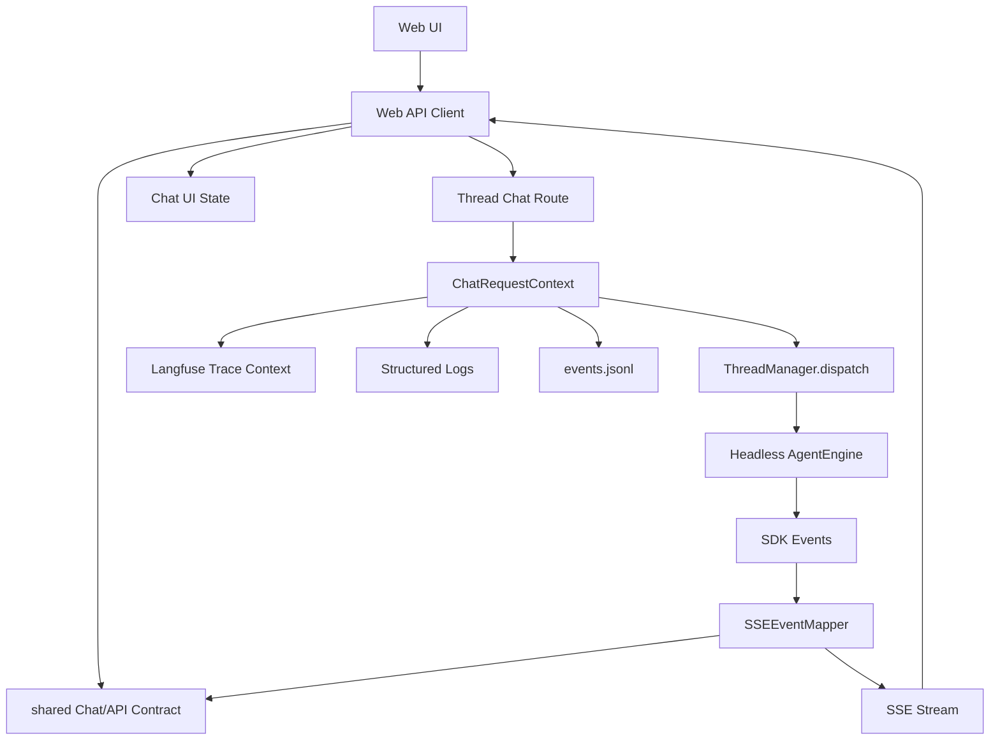

# Chat 契约统一与可观测闭环设计

日期：2026-05-20

## 目标

在 headless engine 第一阶段已经完成的基础上，建立 Neptune AI 的 Chat Turn Contract：一次用户消息从浏览器发出，到 Server 编排、Engine 执行、SSE 返回、事件持久化、Langfuse 记录，必须围绕同一个请求身份、同一组事件类型、同一个错误语义运转。

这轮工作的目标不是“多加几个测试”或“多打几行日志”，而是把产品最核心的用户动作变成可验证的系统契约。

## 当前事实

### 已完成基础

- Server 真实 Engine 路径已经改为 headless runtime。
- `bypassPermissions: true` 已被 `TenantPermissionDelegate` 替代。
- controlled engine 路径仍可作为产品层浏览器自动化测试入口。
- 本地 Langfuse 已可启动并初始化。

### 仍然存在的漂移

1. SSE 事件类型重复定义：
   - `server/src/services/sse-event-mapper.ts`
   - `server/src/services/plan/types.ts`
   - `web/src/types/chat.ts`
   - `web/src/api/threads.ts`

2. HTTP 错误格式不统一：
   - 多数路由手写 `{ error, message }`。
   - Web API client 多处只抛 `failed: status`。
   - SSE error 使用 `{ error, message }`，但普通 message event 使用 `data.type`。

3. Chat dispatch 缺少贯穿式 request identity：
   - SSE `connected` 只有 `threadId` 和 `timestamp`。
   - server request log、ThreadManager log、events.jsonl、Langfuse trace 没有同一个 `requestId`。
   - 浏览器无法从一次失败直接定位到 Server log 和 Langfuse trace。

4. Langfuse provider 有并发串线风险：
   - `LangfuseTracingProvider` 内部维护 `currentTrace/currentTurnSpan/currentRoundSpan/lastGeneration`。
   - provider 是全局单例。
   - 两个并发 dispatch 可能覆盖同一个 provider 的当前上下文。

5. Usage 绑定仍是 manager 级字段：
   - `ThreadManager.lastUsage` 是实例字段。
   - SSE `done` 通过 `threadManager.getLastUsage()` 读取。
   - 并发 chat 可能拿到别的请求的 usage。

6. `neptune-ai/CONTEXT.md` 已声明依赖 `shared/`，根目录也已经存在 `shared/types` 骨架，但目前只有 `.gitkeep`，尚未承载 Neptune AI 的真实协议类型。

## 第一性原则

### 1. Chat Turn 是产品的原子动作

对用户来说，一次 chat turn 不是 LLM call，也不是 SSE message，也不是数据库记录。它是一个完整闭环：

```text
user input -> request -> dispatch -> engine events -> SSE -> UI state -> trace/log/persist
```

系统设计必须把这个闭环当成一等概念，而不是让每层各自拼字段。

### 2. Interface 必须先于实现细节

SSE mapper、前端 hook、Langfuse processor、events.jsonl 都只是 Implementation。真正需要稳定的是 Interface：

- Chat request identity。
- Chat stream event union。
- API error envelope。
- Done/usage 语义。
- Trace metadata 语义。

如果 Interface 不稳定，E2E 测试只能证明“某次刚好能跑”，不能证明系统语义稳定。

### 3. 可观测性不是附属功能

Agent 产品的失败通常跨越前端、Server、Engine、Provider、Tool、MCP、权限。没有 requestId 和 trace 关联，就无法解释失败，也无法提升体验。

可观测性必须是 Chat Turn Contract 的一部分。

### 4. 深 Module 应该提高杠杆

这轮不追求“大而全的 shared 平台”。第一刀只在根目录 `shared/types` 下建立最小但深的 Neptune AI 契约 Module：

- Interface 小。
- 调用方收益大。
- Server 和 Web 都依赖它。
- 测试围绕它建立。

## 设计概览

在根目录已有共享层中新增 Neptune AI 的最小共享契约：

```text
shared/types/neptune-ai/
  api/
    common.ts
    agents.ts
    threads.ts
    chat-events.ts
  chat/
    view.ts
  observability.ts
  index.ts
```

这个 Module 只放跨进程/跨层契约，不放业务实现。

### Chat Contract

Chat Contract 定义：

- `ChatRequestContext`
- `ChatStreamEvent`
- `ChatMessageBlock`
- `PlanTask`
- `ThreadStatus`
- `ChatDonePayload`
- `ChatErrorPayload`

Server 负责把 Engine SDK events 映射为 `ChatStreamEvent`。

Web 负责消费 `ChatStreamEvent`，转换为本地 UI state。

events.jsonl 也持久化同一组事件，加上 `_role`、`_meta` 等内部事件时必须明确标记为非 SSE 合约事件。

### API Contract

API Contract 定义：

- `ApiErrorEnvelope`
- `ApiSuccessEnvelope<T>`（仅用于已经包 data/meta 的端点）
- `ListThreadsResponse`
- `ThreadDto`
- `AgentTemplateDto`

第一阶段不强制全站所有接口一次性迁移。先迁移 chat/thread/agent 所需类型，避免改动面过大。

### Observability Contract

Observability Contract 定义：

- `requestId`
- `traceId` 或 `traceUrl`（当 Langfuse 可提供时）
- `tenantId`
- `userId`
- `agentId`
- `threadId`
- `sdkSessionId`
- `model`

每次 chat dispatch 必须有一个 `ChatRequestContext`。它需要出现在：

- HTTP response header：`X-Request-Id`
- SSE `connected` payload
- Server route log
- ThreadManager dispatch log
- events.jsonl 元数据
- Langfuse trace metadata
- SSE `done` 或 `error` payload

## 目标架构



## 模块设计

### Module：`shared/types/neptune-ai/api/chat-events`

职责：

- 定义 chat turn 的跨层事件。
- 定义 UI blocks 与 server SSE 的共享字段。
- 定义 done/error payload。

不负责：

- 不做 SDK event 映射。
- 不做 React state 更新。
- 不做数据库读写。
- 不做 Langfuse 上报。

建议 Interface：

```ts
export type ChatStreamEvent =
  | ChatConnectedEvent
  | ChatTextEvent
  | ChatThinkingEvent
  | ChatToolUseEvent
  | ChatToolResultEvent
  | ChatToolStatusEvent
  | ChatAskUserEvent
  | ChatArtifactEvent
  | ChatPlanCreatedEvent
  | ChatPlanStepEvent
  | ChatPlanDoneEvent
  | ChatDoneEvent
  | ChatErrorEvent;
```

关键规则：

- 对浏览器统一发送 `event: message` 时，业务类型仍以 `data.type` 为准。
- `done` 与 `error` 可以继续作为 SSE event name，但 payload 也必须符合共享类型。
- 每个 stream event 都可以携带 `requestId`，至少 connected/done/error 必须携带。

### Module：`shared/types/neptune-ai/api`

职责：

- 定义 HTTP 错误信封。
- 定义 thread/agent/chat API DTO。
- 给 Web client 和 Server route 提供同一类型来源。

建议错误信封：

```ts
export interface ApiErrorEnvelope {
  error: string;
  message: string;
  requestId?: string;
  details?: Record<string, unknown>;
}
```

第一阶段不要求所有 route 使用统一错误 helper，但 chat/thread route 应先接入。

### Module：`shared/types/neptune-ai/observability`

职责：

- 定义跨层 request identity。
- 定义 trace metadata shape。

建议 Interface：

```ts
export interface ChatRequestContext {
  requestId: string;
  tenantId: string;
  userId: string;
  agentId: string;
  threadId: string;
  sdkSessionId?: string;
  model?: string;
}
```

## Langfuse 设计

### 问题

当前 `LangfuseTracingProvider` 是全局 provider，并维护当前 trace 状态。这种设计在单请求下简单，但在并发请求中不安全。

### 推荐方案：per-dispatch trace session

保留全局 Langfuse client，但每次 dispatch 创建独立的 tracing session / processor。

设计方向：

- 全局对象只负责持有 Langfuse client。
- `createChatTrace(context)` 返回请求级 tracing adapter。
- 请求级 adapter 持有自己的 trace、turn、round、generation 引用。
- `TracingEventProcessor` 依赖请求级 adapter，而不是全局 mutable provider。

第一阶段可以最小化实现：

- 不一次性重写全部 provider interface。
- 先让 `TracingEventProcessor` 使用每次请求新建的 `LangfuseTracingProvider` 实例。
- `observability/index.ts` 提供 `createTracingProviderForRequest()`。
- 旧 `getTracingProvider()` 保留兼容，但 chat dispatch 不再使用共享 provider 实例。

这能先消除并发串线风险，同时避免大范围改 Engine observability 抽象。

## Usage 设计

### 问题

`ThreadManager.lastUsage` 是 manager 级状态，属于并发风险。

### 推荐方案

让 usage 成为 dispatch 的局部结果：

- `dispatch()` 内部维护 `dispatchUsage`。
- `query:complete` 写入局部变量。
- dispatch 结束前 yield 一个内部 `done` 事件，或返回一个包含 usage 的 terminal event。

第一阶段建议：

- 新增 `ChatDispatchEvent` union。
- `ThreadManager.dispatch()` 可 yield SDK event、plan event、以及 `{ type: 'dispatch_done', usage }`。
- route 接收到 `dispatch_done` 后写 SSE `done`。
- 删除 chat route 对 `threadManager.getLastUsage()` 的依赖。

## SSE 设计

### 当前行为

- Server 写 `event: connected`。
- 大多数业务事件写 `event: message`，payload 里有 `type`。
- 完成写 `event: done`。
- 错误写 `event: error`。
- Web client 按 event name 和 `data.type` 混合解析。

### 保留策略

为了不破坏前端和已有测试，第一阶段保留 SSE event name：

- `connected`
- `message`
- `done`
- `error`

但要求 payload 类型统一：

- `connected` payload：`ChatConnectedEvent`
- `message` payload：`Exclude<ChatStreamEvent, connected|done|error>`
- `done` payload：`ChatDoneEvent`
- `error` payload：`ChatErrorEvent`

Web client 解析后统一回调 `ChatStreamEvent`，不再使用 `{ type: string; data: unknown }`。

## 测试策略

### Contract Tests

新增契约测试，先不启动浏览器：

- `sse-event-mapper` 输出满足 `ChatStreamEvent`。
- plan event 类型与 web `PlanTask` 状态兼容。
- API error envelope 包含 `requestId`。
- `dispatch_done` usage 不走全局 `lastUsage`。

### Server Tests

覆盖：

- chat route `connected/done/error` payload 带 requestId。
- 并发 dispatch 返回各自 usage。
- Langfuse tracing provider 每次 dispatch 独立实例。
- permission deny 事件能被记录到 trace/log（第一阶段可先记录 log/context，trace 可作为下一步）。

### Browser Tests

覆盖：

- controlled chat 成功路径：用户消息、assistant streaming、done 后输入恢复。
- controlled chat error 路径：错误显示、输入恢复、requestId 可见于网络/SSE payload。
- browser console 无非预期错误。

### Observability Tests

先做 fake provider 测试：

- 一次 chat 创建一个 trace。
- trace metadata 包含 requestId/threadId/agentId/tenantId/userId/model。
- 两个并发 chat 不共享 trace/span/generation。

## 分阶段实施

### 阶段 1：契约层与最小接入

1. 在 `shared/types/neptune-ai` 下定义 chat/api/observability 类型。
2. 给 Server/Web 配置最小 path alias，让它们能 type-only import 共享契约。
3. Server SSE mapper 改用共享类型。
4. Web chat 类型改为引用共享类型。
5. 增加契约测试。

### 阶段 2：requestId 贯穿 Chat Route

1. Chat route 创建 `requestId`。
2. response header 写 `X-Request-Id`。
3. SSE connected/done/error payload 携带 requestId。
4. ThreadManager dispatch 接收 `ChatRequestContext`。
5. events.jsonl 写入 request metadata。

### 阶段 3：Usage 局部化

1. 将 `lastUsage` 从 chat route 路径移除。
2. dispatch yield `dispatch_done`。
3. route 使用 dispatch terminal event 写 done。
4. 增加并发测试。

### 阶段 4：Langfuse per-request 化

1. 保留全局 Langfuse client。
2. 每次 chat dispatch 创建独立 provider/session。
3. trace metadata 接入 `ChatRequestContext`。
4. 增加 fake Langfuse 并发测试。

### 阶段 5：浏览器门禁

1. 将 excluded Playwright specs 归档或纳入 project。
2. controlled chat 增强为严格断言。
3. 增加 requestId/SSE/错误恢复断言。
4. 输出测试覆盖矩阵和报告。

## 验收标准

第一轮完成标准：

1. Server 和 Web 不再分别定义 chat stream event union。
2. Chat route 的 `connected/done/error` 都携带同一个 `requestId`。
3. Web SSE client 对外暴露共享 `ChatStreamEvent`。
4. `ThreadManager.dispatch()` 不再依赖全局 `lastUsage` 给 chat route 返回 usage。
5. Langfuse chat dispatch 不再使用全局 mutable provider state。
6. 至少有一个 contract test 能在 Server 侧硬断言 SSE event shape。
7. 至少有一个 browser test 能验证 controlled chat 成功路径和输入恢复。
8. 至少有一个 observability test 能证明并发 trace 不串线。

## 非目标

本轮不做：

- 不重做全站所有 API route。
- 不迁移数据库 schema。
- 不重做 UI 视觉设计。
- 不强依赖真实 LLM 网络调用。
- 不一次性重构 neptune-engine 全部 observability 模型。

## 结论

headless engine 修正的是“Server 不应该依赖 UI”的层级问题。下一步 Chat Contract 修正的是“产品原子动作必须有统一语义”的系统问题。

这两步连起来，Neptune AI 才能从“局部能跑”进入“可解释、可测试、可演进”的阶段。
