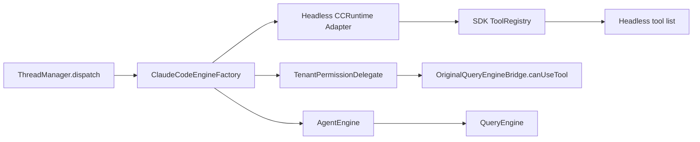

# Layered Architecture Optimization Design

Date: 2026-05-20

## Goal

Optimize Neptune AI according to `docs/reports/2026-05-20-improvement-recommendations.md` by improving the correct layer instead of patching symptoms. The first implementation slice must make the server's real engine path headless and permission-aware, while preserving the existing controlled engine path for product-level browser tests.

## First Principles

The product layer should orchestrate Agent work; it should not inherit UI, CLI, or tool-rendering concerns from the engine. The engine layer should provide a deep Module: a small headless Interface that hides runtime and tool details behind the implementation. The shared layer should later carry protocol Interface definitions, not business behavior.

The optimization therefore starts at the engine/server Seam where behavior varies by host environment:

- CLI/Desktop host: may use UI-aware tools and renderers.
- Server host: must use a headless tool registry, deterministic permission decisions, and request-scoped state.
- Product tests: may use controlled engine Adapter to validate UI and SSE without LLM calls.

## Scope

### In Scope For The First Slice

1. Make the server real engine Adapter use a headless CCRuntime/ToolRegistry path.
2. Ensure importing and running the server's real engine path does not load React/Ink UI modules.
3. Replace `bypassPermissions: true` in the server engine factory with `TenantPermissionDelegate`.
4. Add focused tests for:
   - headless import/runtime behavior;
   - delegate allow/deny behavior;
   - server engine factory passing permissions through the correct Interface;
   - real engine mock-provider chat path when feasible without network.
5. Keep controlled engine tests intact as product orchestration tests.

### Out Of Scope For The First Slice

1. Full shared SSE/API contract migration.
2. Langfuse request correlation and per-trace provider redesign.
3. Global HTTP/SSE error envelope migration.
4. Database migration chain cleanup.
5. Frontend UI redesign.

These are subsequent slices after the headless engine Seam is proven.

## Architecture

### Module: `AgentEngine`

Current Interface:

- `AgentEngine.create(config, ccRuntime?)`.
- `AgentEngineConfig.extensions.permissions`.
- Optional `toolsets`, currently underused.

Current Implementation issue:

- The default runtime falls through to `DefaultCCRuntime.getAllBaseTools()`, which requires `tools.ts`.
- `tools.ts` statically imports builtin tools that can transitively load UI/Ink/React modules.

Design:

- Preserve `AgentEngine.create(config, ccRuntime?)` as the external Interface.
- Treat `ccRuntime` as the primary host-environment Seam.
- For server use, provide an Adapter that installs SDK/headless tools before query construction.
- Avoid changing callers into knowing which individual tool files are safe. That knowledge belongs behind the runtime/tool registry implementation.

Expected Depth:

- Server callers learn only "use headless runtime" and "pass permission delegate".
- Tool selection, UI avoidance, and QueryEngine compatibility stay local to engine implementation.

### Module: `CCRuntime` And `ToolRegistry`

Current Interface:

- `CCRuntime.getAllBaseTools()`.
- Optional `setToolRegistry(registry)`.
- `DefaultToolRegistry({ mode: 'sdk' | 'cli' })`.

Current Implementation issue:

- `DefaultToolRegistry({ mode: 'sdk' })` exists, but the server real path does not reliably activate it.
- `tools.ts` still defaults to CLI mode and imports too much at module load.

Design:

- Use `DefaultToolRegistry({ mode: 'sdk' })` as the server Adapter.
- If needed, add a small factory such as `createHeadlessCCRuntime()` or `createSDKCCRuntime()` in `neptune-engine` so product code does not assemble runtime internals.
- The Adapter should satisfy the existing `CCRuntime` Interface and avoid importing `tools.ts`.

Expected Locality:

- UI coupling fixes stay inside `neptune-engine`.
- `neptune-ai/server` does not list builtin tool implementation paths or UI exclusions.

### Module: `ClaudeCodeEngineFactory`

Current Interface:

- `createAndLoad({ identityOverride, skills, instructions, memoryRoot, workspace, tools, mcpServerUrls, tenantId })`.

Current Implementation issue:

- Creates `TenantPermissionDelegate`, then bypasses it with `permissions: { bypassPermissions: true }`.
- Does not inject a server/headless runtime Adapter.

Design:

- Keep the factory Interface stable for `ThreadManager`.
- Internally use the engine's headless runtime Adapter.
- Pass `permissions: { delegate: permissionDelegate }`.
- Preserve provider, memory, skills, and instructions behavior.

Expected Leverage:

- Every real server dispatch benefits without changing route or UI code.
- Permission tests exercise the same Seam production uses.

### Module: `TenantPermissionDelegate`

Current Interface:

- `onToolAccess(toolName, input) => 'allow' | 'deny'`.

Current Implementation issue:

- The delegate is mostly correct but has weak path normalization. Prefix matching can be tricked by paths like `/tenant/workspace2` or unnormalized relative segments.
- MCP allowlist receives URLs from factory but the delegate expects server names.

Design:

- Keep the permission Interface small.
- Improve implementation locality:
  - normalize workspace and input paths via path resolution;
  - deny relative escape paths;
  - pass MCP server names, not URLs, into the delegate.
- Continue returning only `allow` or `deny` for headless server mode.

Expected Depth:

- Callers do not duplicate file or MCP permission logic.
- Tests target permission policy at the delegate Interface.

## Data Flow

## Error Handling

The first slice should not introduce the full `AppError` envelope. It should improve only local failure clarity:

- Engine factory creation failures should include tenant/workspace context in logs.
- Permission denials should return deterministic deny messages from `OriginalQueryEngineBridge`.
- Tests should assert denial behavior through the engine bridge or delegate, not through string-only route behavior.

## Testing

Required tests for the first slice:

1. `neptune-engine` headless import/runtime test:
   - importing the public engine entrypoint remains safe;
   - creating the server/headless runtime and getting tools does not require `tools.ts`;
   - SDK registry includes expected core tools and excludes UI/CLI-only tools.
2. `neptune-ai/server` permission tests:
   - unauthorized tool denied;
   - workspace escape denied;
   - sibling-prefix path denied;
   - allowed file inside workspace allowed;
   - unregistered MCP server denied.
3. `neptune-ai/server` engine factory test:
   - `AgentEngine.create` receives permission delegate, not bypass mode;
   - factory uses the headless runtime Adapter.
4. Existing regression tests:
   - controlled chat server tests still pass;
   - selected engine CCRuntime and public entrypoint tests still pass.

## Subsequent Slices

After the first slice passes:

1. Shared contract slice:
   - create `shared/types` DTO and SSE event union;
   - server mapper and web chat hook import from shared;
   - add contract tests.
2. Request-scoped observability slice:
   - requestId middleware;
   - per-dispatch usage instead of `ThreadManager.lastUsage`;
   - Langfuse per-trace context Adapter instead of mutable singleton trace fields.
3. Error envelope slice:
   - `AppError` Interface;
   - Fastify error handler;
   - SSE error envelope;
   - web client recovery messages.
4. Test and migration cleanup slice:
   - remove stale EnginePool assertions;
   - classify tests by unit/integration/contract/browser/observability;
   - converge database migration entrypoint.

## Acceptance Criteria

The first implementation slice is accepted when:

1. The server real engine path can construct an engine using a headless runtime without importing UI/Ink stubs.
2. `ClaudeCodeEngineFactory` no longer sets `bypassPermissions: true`.
3. `TenantPermissionDelegate` is the active permission Adapter for server real dispatch.
4. Permission tests prove unauthorized tool, path escape, sibling-prefix path, and unregistered MCP denial.
5. Controlled engine browser/server tests remain green.
6. No frontend UI behavior is changed except as a consequence of valid server-side SSE behavior.

## Non-Goals

- Do not fix this by adding more files under `neptune-engine/src/ui`.
- Do not move product tenant or billing logic into `neptune-engine`.
- Do not make `shared` depend on `neptune-ai` or `neptune-engine`.
- Do not remove controlled engine; it remains a test Adapter with different purpose from the real headless engine Adapter.

