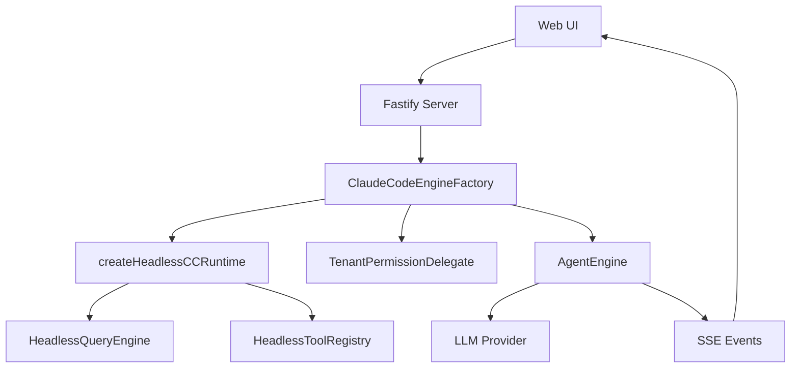
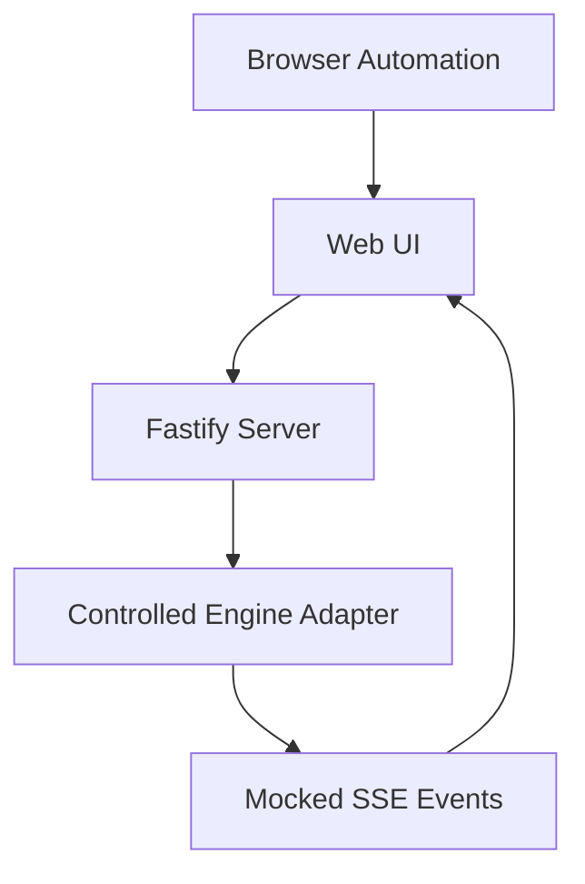

# 分层架构优化设计

日期：2026-05-20

## 目标

按照 `docs/reports/2026-05-20-improvement-recommendations.md` 的改进建议，对 Neptune AI 做一次“选对层级”的架构优化，而不是继续在现象层补丁。

本轮第一阶段的目标是：让服务端的真实 Engine 路径彻底无头化，并具备租户级权限控制；同时保留现有 controlled engine 路径，用于产品层浏览器自动化测试和无 LLM 调用的 UI/SSE 验证。

## 第一性原则

Neptune AI 的分层边界应当清晰：

1. 产品层负责组织 Agent 工作流、UI 交互、会话、SSE 和用户体验。
2. Server 层负责多租户、认证、权限、持久化、可观测性和运行时编排。
3. Engine 层负责 Agent 执行能力，但不应绑定 React、Ink、CLI、桌面 UI 或工具渲染。
4. Shared 层后续应承载稳定协议和类型接口，而不是承载业务行为。

因此，本轮优化从 Engine 与 Server 的交界处开始。这里是宿主环境差异最大的地方：

- CLI/Desktop 宿主：可以加载 UI-aware tools、终端渲染器、CLI 权限提示。
- Server 宿主：必须使用无 UI 依赖的 tool registry、确定性的权限委托、请求级状态隔离。
- 产品测试宿主：可以使用 controlled engine adapter，在不调用真实 LLM 的情况下验证 UI、SSE 和业务编排。

这个切入点的判断标准是：底层必须更干净，而不是让 Server 继续为 Engine 的 UI 依赖补 stub。

## 范围

### 第一阶段范围

1. 让服务端真实 Engine Adapter 使用 headless CCRuntime / ToolRegistry 路径。
2. 确保服务端导入和运行真实 Engine 路径时不会加载 React、Ink 等 UI 模块。
3. 用 `TenantPermissionDelegate` 替代服务端原有的 `bypassPermissions: true`。
4. 增加聚焦测试，覆盖：
   - headless runtime 的导入和运行行为；
   - 权限委托的 allow/deny 行为；
   - server engine factory 是否通过正确接口注入权限和 runtime；
   - 在可行范围内验证真实 engine 的 mock-provider chat 路径。
5. 保留 controlled engine 测试，把它作为产品编排层测试，而不是底层 Engine 测试。

### 第一阶段不做

1. 不在本阶段迁移完整 shared SSE/API 协议。
2. 不在本阶段重做 Langfuse trace/provider 关联模型。
3. 不在本阶段统一全局 HTTP/SSE 错误信封。
4. 不在本阶段清理数据库 migration 历史链。
5. 不在本阶段重做前端 UI。

这些工作应在 headless engine 边界被证明稳定后，再作为后续阶段推进。

## 架构设计

### 模块：`AgentEngine`

当前外部接口：

- `AgentEngine.create(config, ccRuntime?)`
- `AgentEngineConfig.extensions.permissions`
- `toolsets` 可选，目前使用较少。

原问题：

- 默认 runtime 会落到 `DefaultCCRuntime.getAllBaseTools()`。
- 旧路径会加载 `tools.ts`。
- `tools.ts` 静态导入内置工具，部分工具会传递加载 UI/Ink/React 模块。
- Server 为了跑起来只能补 UI stub，这说明分层已经倒置。

设计决策：

- 保持 `AgentEngine.create(config, ccRuntime?)` 作为外部接口不变。
- 在 Engine 内新增 server 可用的 headless adapter。
- Server 显式选择 headless runtime，而不是让 Engine 默认路径猜测宿主环境。
- CLI/Desktop 仍可继续走原有 UI-aware runtime。

当前已落地形态：

- `HeadlessQueryEngine`：服务端使用的无头 QueryEngine 实现，避免实例化 CLI 版 `QueryEngine.ts`。
- `HeadlessToolRegistry`：服务端使用的无 UI tool registry。
- `createHeadlessCCRuntime()`：创建服务端可用的 headless CCRuntime。
- `OriginalQueryEngineBridge`：保留原 QueryEngine bridge 的兼容边界。

### 模块：`HeadlessToolRegistry`

职责：

- 提供服务端执行所需的基础工具集合。
- 不导入 React、Ink、CLI UI、权限弹窗或终端渲染相关模块。
- 作为 Server runtime 的明确工具入口。

设计边界：

- 它不是为了模拟 UI 工具。
- 它也不是为了覆盖 CLI 工具的全部交互体验。
- 它只承担服务端真实执行路径需要的、可无头运行的工具能力。

### 模块：`HeadlessQueryEngine`

职责：

- 提供 Server host 下可执行的 QueryEngine。
- 避免服务端加载 CLI QueryEngine 的 UI 依赖。
- 支撑真实 provider 的基础消息流能力。

当前边界：

- 已经能证明 Server 不再因为 UI import 失败。
- 当前 headless query 更接近最小 Anthropic SSE 文本流 adapter。
- 完整 tool loop、复杂 core tool extraction 和更深的 provider 行为还应作为后续深化项处理。

### 模块：`ClaudeCodeEngineFactory`

职责：

- 在 Server 层把数据库中的 agent/model/mcp 配置转换为 Engine 可执行配置。
- 注入 headless runtime。
- 注入租户级权限委托。
- 组装系统提示词、工作区、模型和 MCP server 列表。

当前已落地形态：

- 使用 `createHeadlessCCRuntime()`。
- 使用 `TenantPermissionDelegate`，不再使用 `bypassPermissions: true`。
- 将 `identityOverride + instructions` 拼接为 `systemPrompt`。
- 将 MCP 配置整理为 `mcpServers: Array<{ name, url }>`，让权限 delegate 以 server name 做 allowlist 判断。

### 模块：`TenantPermissionDelegate`

职责：

- 在服务端做确定性权限决策。
- 以租户/Agent 配置为依据，判断工具、文件路径和 MCP server 是否允许。
- 避免请求运行时出现交互式权限提示。

关键规则：

- 文件路径必须被 normalize。
- 使用 `resolve`、`relative`、`isAbsolute` 防止路径逃逸。
- MCP allowlist 优先于普通工具白名单。
- 拒绝不在工作区内的文件访问。
- 拒绝未授权 MCP server。

## 数据流

### 真实服务端 Engine 路径



### 产品测试路径



controlled engine 的价值是验证产品层行为，而不是伪装成真实底层执行。它应该继续存在，但不能掩盖真实 Engine 路径的架构问题。

## 错误处理策略

本阶段不做全局错误协议迁移，但需要保证：

1. Headless runtime 导入失败应暴露为 Engine 初始化错误。
2. 权限拒绝应通过明确的 deny 结果表达，而不是静默失败。
3. Server 不应通过 UI stub 吞掉底层依赖错误。
4. 测试应覆盖“拒绝路径”，避免只验证 happy path。

## 测试策略

### Engine 单元测试

覆盖：

- `createHeadlessCCRuntime()` 可创建 runtime。
- `getAllBaseTools()` 不触发 `tools.ts` fallback。
- public entrypoint 正确导出 headless factory。
- headless runtime 不加载 UI-only 模块。

### Server 单元测试

覆盖：

- `TenantPermissionDelegate` 允许合法工作区路径。
- `TenantPermissionDelegate` 拒绝路径逃逸。
- MCP allowlist 判断使用 server name。
- `ClaudeCodeEngineFactory` 注入 headless runtime 和 permissions delegate。

### Server 集成测试

覆盖：

- controlled engine chat path 继续可用。
- threads chat path 继续可用。
- 本地 Docker 依赖的测试需要在可访问数据库/服务时运行。

### 浏览器自动化测试

浏览器自动化继续用于验证：

- 登录/认证。
- Agent 管理。
- 会话创建。
- SSE 消息展示。
- 模型交互 UI 完整性。

它不应该替代 Engine 层测试。浏览器测试证明产品可用，Engine 测试证明底层边界正确。

## 验收标准

第一阶段完成标准：

1. 服务端真实 Engine 路径不再依赖 UI stub。
2. 服务端真实 Engine 路径导入时不再因为 `../hooks/useSettings.js` 等 UI 模块缺失而失败。
3. `bypassPermissions: true` 被替换为 `TenantPermissionDelegate`。
4. Engine headless runtime 测试通过。
5. Server 权限委托测试通过。
6. controlled engine 的产品层测试保持通过。
7. 文档描述与当前实现一致。

## 已验证命令

以下验证在当前实现中已经通过：

```bash
cd neptune-engine
bun test src/engine/cc-runtime/__tests__/CCRuntime.test.ts src/engine/cc-runtime/__tests__/headless-runtime.test.ts src/engine/__tests__/public-entrypoint.test.ts
```

```bash
cd neptune-ai/server
bun test test/permission-delegate.test.ts test/engine-factory-permissions.test.ts
```

依赖本地 Docker 服务的测试也已在沙箱外通过：

```bash
cd neptune-ai/server
bun test test/controlled-engine-chat.test.ts
bun test test/threads-chat.test.ts
```

## 后续阶段

### 阶段二：协议与事件契约

- 收敛 shared SSE/API 类型。
- 明确 server-to-web 的事件信封。
- 统一错误和完成状态。

### 阶段三：可观测性

- 将 Langfuse trace 与请求、thread、agent、provider call 绑定。
- 建立端到端 trace 视图。
- 区分产品事件、Engine 事件、LLM provider 事件。

### 阶段四：工具循环深化

- 完善 headless tool loop。
- 明确工具调用、权限、MCP 和 provider streaming 的一致语义。
- 让真实 Engine 路径覆盖更多生产场景。

### 阶段五：数据库与迁移清理

- 清理 migration 链。
- 明确 schema drift 检测。
- 建立测试数据库初始化规范。

## 非目标

本设计不是一次 UI 优化，也不是一次测试脚本堆叠。它的核心是修正层级依赖方向：Server 不能依赖 UI，Engine 不能强迫 Server 承担 CLI/Desktop 的交互假设。

判断本轮工作是否正确，不看代码改了多少，而看边界是否更清晰、测试是否能证明边界、后续演进是否更容易。
